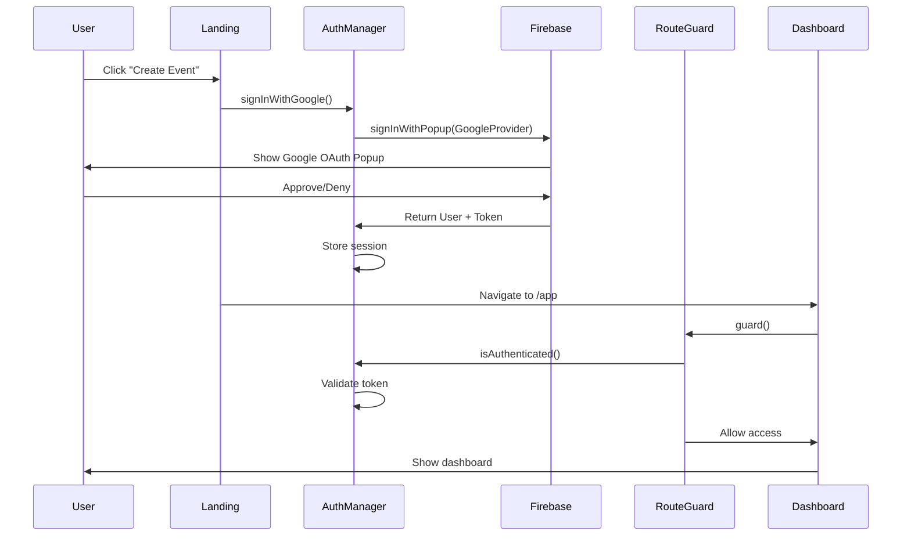

# Design Document: Authentication Bypass Fix

## Overview

This design addresses a critical security vulnerability where the quiz application uses mock authentication instead of real Google OAuth, allowing unauthorized access to protected features. The fix involves replacing mock authentication with Firebase Authentication SDK integration, enforcing route protection, and ensuring proper session validation.

The solution maintains backward compatibility with public features (free play, event participation) while securing protected features (dashboard, event creation) behind real authentication.

## Architecture

### Current Architecture (Vulnerable)

```
Landing Page → Mock Sign-In → Dashboard (No Real Auth Check)
                    ↓
              Auto-creates fake user
              Always succeeds
```

### New Architecture (Secure)

```
Landing Page → Firebase OAuth Popup → Real Auth Check → Dashboard
                       ↓                      ↓
                 Google Sign-In        Route Guard
                       ↓                      ↓
                 Firebase Token         Validates Token
                       ↓                      ↓
                 Store Session          Allow/Deny Access
```

### Component Interaction Flow




## Components and Interfaces

### 1. AuthManager (auth-manager.js)

**Purpose**: Manage Google OAuth authentication using Firebase Authentication SDK

**Current Issues**:
- Uses mock authentication with fake user generation
- Always succeeds without real OAuth
- Stores fake tokens in localStorage

**New Implementation**:

```javascript
class AuthManager {
    constructor() {
        this.auth = null;              // Firebase Auth instance
        this.googleProvider = null;     // Google Auth Provider
        this.currentUser = null;
        this.authStateListeners = [];
        this.initialized = false;
    }

    async initialize() {
        // Initialize Firebase Auth SDK
        // Set up Google Auth Provider
        // Set up auth state listener
        // Restore session if valid
    }

    async signInWithGoogle() {
        // Use Firebase signInWithPopup(googleProvider)
        // Handle success: store user + tokens
        // Handle errors: network, cancelled, unknown
        // Notify listeners
    }

    async signOut() {
        // Call Firebase auth.signOut()
        // Clear localStorage
        // Notify listeners
    }

    isAuthenticated() {
        // Check currentUser exists
        // Validate token not expired
        // Return boolean
    }

    async getIdToken(forceRefresh = false) {
        // Call Firebase user.getIdToken(forceRefresh)
        // Handle token refresh
        // Return token or throw error
    }

    onAuthStateChanged(callback) {
        // Register callback
        // Call immediately with current state
        // Return unsubscribe function
    }
}
```

**Key Changes**:
1. Remove all mock authentication code
2. Import and initialize Firebase Auth SDK
3. Use `signInWithPopup()` with `GoogleAuthProvider`
4. Use Firebase's `onAuthStateChanged` for session management
5. Validate tokens using Firebase methods


### 2. RouteGuard (route-guard.js)

**Purpose**: Protect routes by checking authentication before allowing access

**Current Issues**:
- Exists but not loaded in any HTML files
- Never executes protection logic

**Implementation** (already correct, just needs integration):

```javascript
class RouteGuard {
    async guard() {
        // Check if route is protected
        // Verify authentication
        // Redirect if not authenticated
        // Return true/false
    }

    isProtectedRoute() {
        // Check current path
        // Return true for /app, /app/index.html, /app/create.html
        // Return false for public routes
    }

    redirectToLanding() {
        // Store intended path
        // Redirect to landing page
    }
}
```

**Key Changes**:
1. No code changes needed in route-guard.js
2. Must be loaded in protected HTML pages
3. Must be called before page logic executes

### 3. Protected Pages (app/index.html, app/create.html)

**Current Issues**:
- Do not load route-guard.js
- Execute page logic without auth checks

**New Implementation**:

```html
<!-- Add to <head> section, BEFORE other scripts -->
<script src="../route-guard.js"></script>
<script src="../auth-manager.js"></script>

<!-- In page script, add guard check -->
<script>
document.addEventListener('DOMContentLoaded', async () => {
    // Guard the route FIRST
    const allowed = await window.RouteGuard.guardOnLoad();
    if (!allowed) {
        return; // Stop execution if redirected
    }
    
    // Continue with page logic...
});
</script>
```

**Key Changes**:
1. Load route-guard.js in HTML
2. Call `RouteGuard.guardOnLoad()` before any page logic
3. Stop execution if guard returns false


### 4. Dashboard (app/dashboard.js)

**Current Issues**:
- Has inline auth check but relies on mock auth
- Executes before route guard

**New Implementation**:

```javascript
document.addEventListener('DOMContentLoaded', async () => {
    // Route guard already executed in HTML
    // This is a secondary check
    
    if (!window.AuthManager.isAuthenticated()) {
        window.location.href = '../';
        return;
    }
    
    currentUser = window.AuthManager.getCurrentUser();
    await loadEvents();
    setupEventListeners();
});
```

**Key Changes**:
1. Keep existing inline check as defense-in-depth
2. Rely on route guard as primary protection
3. No other changes needed

### 5. Landing Page (landing.js)

**Current Issues**:
- Triggers mock sign-in that always succeeds

**New Implementation**:

```javascript
async function onCreateEventClick() {
    try {
        // Show loading state
        updateButtonState('Signing in...', true);
        
        // Trigger REAL Google sign-in
        const user = await window.AuthManager.signInWithGoogle();
        
        if (user) {
            // Success - navigate to dashboard
            window.location.href = './app/';
        } else {
            // Cancelled - restore button
            updateButtonState('Sign in with Google', false);
        }
    } catch (error) {
        // Error - show message and restore button
        alert(error.message);
        updateButtonState('Sign in with Google', false);
    }
}
```

**Key Changes**:
1. No changes needed - already calls AuthManager.signInWithGoogle()
2. Will automatically use real auth once AuthManager is fixed


## Data Models

### User Session

```javascript
{
    uid: string,              // Firebase user ID
    email: string,            // User email from Google
    displayName: string,      // User display name
    photoURL: string,         // User profile photo URL
    idToken: string,          // Firebase ID token (JWT)
    refreshToken: string,     // Firebase refresh token
    expiresAt: number        // Token expiration timestamp
}
```

**Storage**: localStorage key `firebase_auth_user`

**Validation**: 
- Must have valid `uid` from Firebase
- `idToken` must not be expired
- Must be verifiable against Firebase Auth

### Authentication State

```javascript
{
    isAuthenticated: boolean,  // Current auth status
    user: User | null,         // Current user or null
    loading: boolean          // Auth initialization in progress
}
```

### Route Protection State

```javascript
{
    isProtected: boolean,      // Is current route protected
    intendedPath: string,      // Path user tried to access
    redirected: boolean       // Was user redirected
}
```

**Storage**: sessionStorage key `intended_path`


## Correctness Properties

A property is a characteristic or behavior that should hold true across all valid executions of a system—essentially, a formal statement about what the system should do. Properties serve as the bridge between human-readable specifications and machine-verifiable correctness guarantees.

### Property Reflection

After analyzing all acceptance criteria, I identified the following redundancies:
- Properties 2.1 and 3.3 both test that route guards check authentication - combined into Property 1
- Properties 2.2 and 2.3 both test redirect behavior - 2.3 is an edge case of 2.2, combined into Property 2
- Properties 3.4 and 5.4 are identical (public routes accessible) - combined into Property 3
- Properties 4.1 and 4.4 both test token validation - combined into Property 4
- Many example-based tests (6.1-6.5, 7.1-7.4, 8.1-8.5) are specific scenarios best tested as unit tests, not properties

### Core Properties

**Property 1: Protected routes enforce authentication**
*For any* protected route (dashboard, event creation), when a user attempts to access it, the route guard must verify authentication before allowing access.
**Validates: Requirements 2.1, 3.3**

**Property 2: Unauthenticated access triggers redirect**
*For any* protected route, when an unauthenticated user (including expired sessions) attempts access, the system must redirect to the landing page and store the intended destination.
**Validates: Requirements 2.2, 2.3, 2.5**

**Property 3: Public routes remain accessible**
*For any* public route (landing, questions, results, spectrum), access must be allowed without authentication regardless of authentication state.
**Validates: Requirements 3.4, 5.4**

**Property 4: Token validation prevents invalid sessions**
*For any* stored session, the Auth_Manager must validate the ID token against Firebase Auth and reject expired or invalid tokens.
**Validates: Requirements 4.1, 4.4**

**Property 5: Successful authentication stores valid credentials**
*For any* successful OAuth flow, the Auth_Manager must store user credentials (uid, email, tokens) in both memory and localStorage.
**Validates: Requirements 1.2**

**Property 6: Failed authentication prevents session creation**
*For any* failed or cancelled OAuth flow, the Auth_Manager must not create any user session or store any credentials.
**Validates: Requirements 1.3**

**Property 7: Token refresh maintains authentication**
*For any* expired token, when getIdToken is called, the Auth_Manager must attempt to refresh the token, and if refresh fails, must clear the session.
**Validates: Requirements 1.5, 4.2, 4.3**

**Property 8: Sign-out clears all session data**
*For any* authenticated user, when signOut is called, the system must revoke the Firebase session and clear all local storage data.
**Validates: Requirements 4.5**

**Property 9: Protected page logic stops after redirect**
*For any* protected route, when the route guard redirects an unauthenticated user, no protected page logic must execute.
**Validates: Requirements 3.5**

**Property 10: Authenticated sessions persist across public routes**
*For any* authenticated user, when navigating to public routes, the authentication session must remain valid and accessible.
**Validates: Requirements 5.5**

**Property 11: No sensitive data in logs**
*For any* authentication operation, log output must not contain tokens, refresh tokens, or other sensitive credentials in plain text.
**Validates: Requirements 7.5**


## Error Handling

### Authentication Errors

**Network Errors** (auth/network-request-failed):
- Display: "Network error. Please check your connection and try again."
- Action: Restore UI to pre-auth state
- Log: Error with code and message

**User Cancellation** (auth/popup-closed-by-user):
- Display: No error message (silent)
- Action: Return to landing page
- Log: Info level log

**Unknown Errors**:
- Display: "Authentication failed. Please try again."
- Action: Restore UI to pre-auth state
- Log: Error with full details

### Token Refresh Errors

**Refresh Failure**:
- Display: No error message (silent logout)
- Action: Clear session, redirect to landing
- Log: Warning level log

### Route Guard Errors

**Initialization Failure**:
- Display: No error message (silent redirect)
- Action: Redirect to landing page
- Log: Error with details

**Missing AuthManager**:
- Display: No error message (silent redirect)
- Action: Redirect to landing page
- Log: Critical error

### Error Logging Format

```javascript
{
    operation: string,        // e.g., "signInWithGoogle"
    error: string,           // Error message
    errorCode: string,       // Firebase error code
    timestamp: number,       // Unix timestamp
    context: object         // Additional context (no sensitive data)
}
```


## Testing Strategy

### Dual Testing Approach

This feature requires both unit tests and property-based tests for comprehensive coverage:

**Unit Tests**: Verify specific examples, edge cases, and integration points
- Specific error messages for different failure scenarios
- HTML structure (script load order)
- Firebase SDK method calls
- Logging output format
- UI state changes during auth flow

**Property Tests**: Verify universal properties across all inputs
- Route protection for all protected routes
- Public route accessibility for all public routes
- Token validation for all stored sessions
- Session clearing for all sign-out operations
- Redirect behavior for all unauthenticated access attempts

### Property-Based Testing Configuration

**Library**: fast-check (JavaScript property-based testing library)

**Configuration**:
- Minimum 100 iterations per property test
- Each test tagged with: `Feature: auth-bypass-fix, Property N: [property text]`

**Test Organization**:
```
test/
  auth-manager.unit.test.js          # Unit tests for AuthManager
  auth-manager.property.test.js      # Property tests for AuthManager
  route-guard.unit.test.js           # Unit tests for RouteGuard
  route-guard.property.test.js       # Property tests for RouteGuard
  auth-integration.unit.test.js      # Integration tests
```

### Unit Test Coverage

**AuthManager Unit Tests**:
- Firebase initialization with correct config (8.1)
- signInWithPopup called with GoogleAuthProvider (8.2)
- Network error displays correct message (6.1)
- User cancellation shows no error (6.2)
- Unknown error displays generic message (6.3)
- signOut calls Firebase signOut method (8.3)
- onAuthStateChanged listener setup (8.4)
- getIdToken called with forceRefresh (8.5)
- Successful auth logging (7.1)
- Failed auth logging (7.2)
- Token refresh logging (7.4)

**RouteGuard Unit Tests**:
- Script load order in HTML files (2.4, 3.1, 3.2)
- Access denial logging (7.3)
- Silent redirect behavior (6.4)
- Intended path storage in sessionStorage

**Integration Unit Tests**:
- Landing page displays both buttons without auth (5.1)
- Free play navigation without auth (5.2)
- Event participation without auth (5.3)
- Silent logout on refresh failure (6.5)

### Property Test Coverage

Each property test must run minimum 100 iterations and reference its design property:

**Property 1**: Generate random protected routes, verify guard checks auth
**Property 2**: Generate random protected routes with unauthenticated users, verify redirect
**Property 3**: Generate random public routes, verify access without auth
**Property 4**: Generate random stored sessions (valid/invalid/expired), verify validation
**Property 5**: Generate random successful auth responses, verify storage
**Property 6**: Generate random auth failures, verify no session created
**Property 7**: Generate random expired tokens, verify refresh attempt
**Property 8**: Generate random authenticated users, verify sign-out clears data
**Property 9**: Generate random protected routes, verify no logic after redirect
**Property 10**: Generate random public route navigations, verify session persists
**Property 11**: Generate random auth operations, verify no tokens in logs

### Mocking Strategy

**Firebase Auth SDK**: Mock using Jest or Sinon
- Mock `signInWithPopup`, `signOut`, `onAuthStateChanged`
- Mock `getIdToken` with configurable responses
- Mock user objects with valid/invalid/expired tokens

**DOM and Navigation**: Mock using jsdom
- Mock `window.location.href` for redirect testing
- Mock `localStorage` and `sessionStorage`
- Mock `document.addEventListener` for DOMContentLoaded

**Console Logging**: Spy on console methods
- Verify log messages without sensitive data
- Verify error logging format

